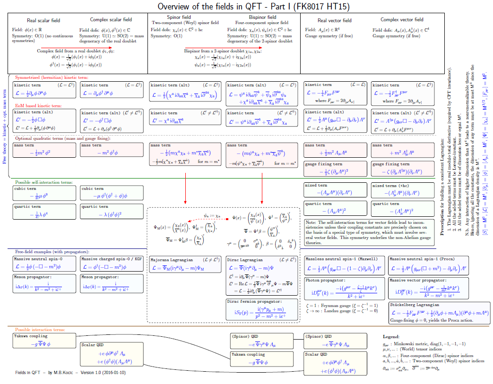

# QFT-fields-overview

Overview of the fields in QFT.

Note: there are two PDF sizes: [408 x 308 mm (compact, without multiplets)](QFT-fields-overview-compact.pdf) 
and [522 x 328 mm (normal, with multiplets)](QFT-fields-overview.pdf).

